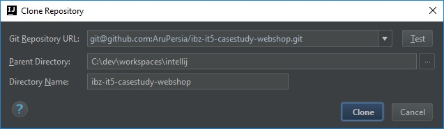

# Installation for IntelliJ
1. Install git-bash: https://git-scm.com/downloads
2. Install PHP
3. Open git-bash console and type: `php -version`

**Output should be something like that:**
```shell
PHP 7.0.1 (cli) (built: Dec 16 2015 13:36:30) ( ZTS )
Copyright (c) 1997-2015 The PHP Group
Zend Engine v3.0.0, Copyright (c) 1998-2015 Zend Technologies
    with Xdebug v2.5.0, Copyright (c) 2002-2016, by Derick Rethans
```
4. Install Composer Dependency Manager: https://getcomposer.org/
5. Open git-bash console and type: `php composer.phar --version`

**Output should be something like that:**
```shell
Composer version 1.2.2 2016-11-03 17:43:15
```
6. Install IntelliJ minimum PhpStorm: https://www.jetbrains.com/phpstorm/?fromMenu 
7. Install Symfony Plugin in IntelliJ:


8. Create new Project from GIT:


9. Checkout with Repository URL:



10. Open git-bash console and type
```shel
cd /c/dev/workspaces/intellij/ibz-it5-casestudy-webshop/
composer.phar install
```

**Output should be something like that:**
```shell
Loading composer repositories with package information
Installing dependencies (including require-dev) from lock file
  - Installing doctrine/lexer (v1.0.1)
    Loading from cache

  - Installing doctrine/annotations (v1.3.1)
    Loading from cache

  - Installing twig/twig (v1.30.0)
    Loading from cache

  - Installing symfony/polyfill-util (v1.3.0)
    Loading from cache

  - Installing paragonie/random_compat (v2.0.4)
    Loading from cache

  - Installing symfony/polyfill-php70 (v1.3.0)
    Loading from cache

  - Installing symfony/polyfill-php56 (v1.3.0)
    Loading from cache

  - Installing symfony/polyfill-mbstring (v1.3.0)
    Loading from cache

  - Installing symfony/symfony (v3.1.8)
    Loading from cache

  - Installing symfony/polyfill-intl-icu (v1.3.0)
    Loading from cache

  - Installing psr/log (1.0.2)
    Loading from cache

  - Installing psr/cache (1.0.1)
    Loading from cache

  - Installing doctrine/inflector (v1.1.0)
    Loading from cache

  - Installing doctrine/collections (v1.3.0)
    Loading from cache

  - Installing doctrine/cache (v1.6.1)
    Loading from cache

  - Installing doctrine/common (v2.6.2)
    Loading from cache

  - Installing jdorn/sql-formatter (v1.2.17)
    Loading from cache

  - Installing doctrine/doctrine-cache-bundle (1.3.0)
    Loading from cache

  - Installing doctrine/dbal (v2.5.5)
    Loading from cache

  - Installing doctrine/doctrine-bundle (1.6.4)
    Loading from cache

  - Installing doctrine/instantiator (1.0.5)
    Loading from cache

  - Installing doctrine/orm (v2.5.6)
    Loading from cache

  - Installing incenteev/composer-parameter-handler (v2.1.2)
    Loading from cache

  - Installing sensiolabs/security-checker (v4.0.0)
    Loading from cache

  - Installing sensio/distribution-bundle (v5.0.16)
    Loading from cache

  - Installing sensio/framework-extra-bundle (v3.0.18)
    Loading from cache

  - Installing monolog/monolog (1.22.0)
    Loading from cache

  - Installing symfony/monolog-bundle (v2.12.1)
    Loading from cache

  - Installing symfony/polyfill-apcu (v1.3.0)
    Loading from cache

  - Installing swiftmailer/swiftmailer (v5.4.5)
    Loading from cache

  - Installing symfony/swiftmailer-bundle (v2.4.2)
    Loading from cache

  - Installing webmozart/assert (1.2.0)
    Loading from cache

  - Installing phpdocumentor/reflection-common (1.0)
    Loading from cache

  - Installing phpdocumentor/type-resolver (0.2.1)
    Loading from cache

  - Installing phpdocumentor/reflection-docblock (3.1.1)
    Loading from cache

  - Installing phpunit/php-token-stream (1.4.9)
    Loading from cache

  - Installing sebastian/version (2.0.1)
    Loading from cache

  - Installing sebastian/resource-operations (1.0.0)
    Loading from cache

  - Installing sebastian/recursion-context (1.0.2)
    Loading from cache

  - Installing sebastian/object-enumerator (1.0.0)
    Loading from cache

  - Installing sebastian/global-state (1.1.1)
    Loading from cache

  - Installing sebastian/exporter (1.2.2)
    Loading from cache

  - Installing sebastian/environment (2.0.0)
    Loading from cache

  - Installing sebastian/diff (1.4.1)
    Loading from cache

  - Installing sebastian/comparator (1.2.2)
    Loading from cache

  - Installing phpunit/php-text-template (1.2.1)
    Loading from cache

  - Installing phpunit/phpunit-mock-objects (3.4.3)
    Loading from cache

  - Installing phpunit/php-timer (1.0.8)
    Loading from cache

  - Installing phpunit/php-file-iterator (1.4.2)
    Loading from cache

  - Installing sebastian/code-unit-reverse-lookup (1.0.0)
    Loading from cache

  - Installing phpunit/php-code-coverage (4.0.4)
    Loading from cache

  - Installing phpspec/prophecy (v1.6.2)
    Loading from cache

  - Installing myclabs/deep-copy (1.5.5)
    Loading from cache

  - Installing phpunit/phpunit (5.5.7)
    Loading from cache

  - Installing sensio/generator-bundle (v3.1.2)
    Loading from cache

  - Installing symfony/phpunit-bridge (v3.2.1)
    Loading from cache

paragonie/random_compat suggests installing ext-libsodium (Provides a modern crypto API that can be used to generate random bytes.)
symfony/polyfill-intl-icu suggests installing ext-intl (For best performance)
doctrine/doctrine-cache-bundle suggests installing symfony/security-acl (For using this bundle to cache ACLs)
sensio/framework-extra-bundle suggests installing symfony/psr-http-message-bridge (To use the PSR-7 converters)
monolog/monolog suggests installing aws/aws-sdk-php (Allow sending log messages to AWS services like DynamoDB)
monolog/monolog suggests installing doctrine/couchdb (Allow sending log messages to a CouchDB server)
monolog/monolog suggests installing ext-amqp (Allow sending log messages to an AMQP server (1.0+ required))
monolog/monolog suggests installing ext-mongo (Allow sending log messages to a MongoDB server)
monolog/monolog suggests installing graylog2/gelf-php (Allow sending log messages to a GrayLog2 server)
monolog/monolog suggests installing mongodb/mongodb (Allow sending log messages to a MongoDB server via PHP Driver)
monolog/monolog suggests installing php-amqplib/php-amqplib (Allow sending log messages to an AMQP server using php-amqplib)
monolog/monolog suggests installing php-console/php-console (Allow sending log messages to Google Chrome)
monolog/monolog suggests installing rollbar/rollbar (Allow sending log messages to Rollbar)
monolog/monolog suggests installing ruflin/elastica (Allow sending log messages to an Elastic Search server)
monolog/monolog suggests installing sentry/sentry (Allow sending log messages to a Sentry server)
sebastian/global-state suggests installing ext-uopz (*)
phpunit/phpunit suggests installing ext-tidy (*)
phpunit/phpunit suggests installing phpunit/php-invoker (~1.1)
Generating autoload files
> Incenteev\ParameterHandler\ScriptHandler::buildParameters
Creating the "app/config/parameters.yml" file
Some parameters are missing. Please provide them.
database_host (127.0.0.1):
database_port (null):
database_name (symfony):
database_user (root):
database_password (null):
mailer_transport (smtp):
mailer_host (127.0.0.1):
mailer_user (null):
mailer_password (null):
secret (ThisTokenIsNotSoSecretChangeIt):
> Sensio\Bundle\DistributionBundle\Composer\ScriptHandler::buildBootstrap
> Sensio\Bundle\DistributionBundle\Composer\ScriptHandler::clearCache

 // Clearing the cache for the dev environment with debug true


 [OK] Cache for the "dev" environment (debug=true) was successfully cleared.


> Sensio\Bundle\DistributionBundle\Composer\ScriptHandler::installAssets

 Trying to install assets as relative symbolic links.

 --------- ----------------- ----------------
            Bundle            Method / Error
 --------- ----------------- ----------------
  WARNING   FrameworkBundle   copy
 --------- ----------------- ----------------

 ! [NOTE] Some assets were installed via copy. If you make changes to these assets you have to run this command again.


 [OK] All assets were successfully installed.


> Sensio\Bundle\DistributionBundle\Composer\ScriptHandler::installRequirementsFile
> Sensio\Bundle\DistributionBundle\Composer\ScriptHandler::prepareDeploymentTarget
```

11. Crate MySql Database

host: `localhost`, port: `3306`, db-name: `webshop`, db-user: `devUser` db-password: `Secure4Access`

12. Configure MySQL Parameters in Symfony file `C:\dev\workspaces\intellij\ibz-it5-casestudy-webshop\app\config\parameters.yml`
```yml
# This file is auto-generated during the composer install
parameters:
    database_host: localhost
    database_port: 3306
    database_name: webshop
    database_user: devUser
    database_password: Secure4Access
    mailer_transport: smtp
    mailer_host: 127.0.0.1
    mailer_user: null
    mailer_password: null
    secret: ThisTokenIsNotSoSecretChangeIt
```

13. Open git-bash console and type
```shel
$ cd /c/dev/workspaces/intellij/ibz-it5-casestudy-webshop/
$ php bin/console doctrine:schema:create
```

**Output should be something like that:**
```shell
ATTENTION: This operation should not be executed in a production environment.

Creating database schema...
Database schema created successfully!
```